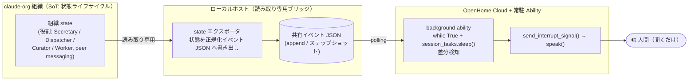

# openhome-ambient-announcer — 設計・技術調査ドキュメント (M1)

OpenHome 常駐 Ability で、claude-org マルチエージェント組織の状況（完了・ブロッカー・承認待ち等）を
**音声で能動アナウンス**する一方向連携の設計。OpenHome DevKit 連携チャレンジの M1 成果物。

> **凡例（事実と推測の区別）**
> `✓` 公式ドキュメントで確認済み ／ `◆` ベンダー主張（doc 未確認） ／ `≈` 本資料の推測・要検証
> OpenHome 基礎調査の一次情報は別途の調査資料に準拠する（本書はゼロから再調査せず、`≈` 点を検証/拡張する）。

---

## 1. 概要・ゴール・非ゴール

### 1.1 何を作るか
OpenHome の **Background（Always-On）Ability** を常駐させ、組織の状態変化を検知して
`speak()` で能動的に読み上げる「アンビエント状況アナウンサー」。
ダッシュボードを注視しなくても、耳で組織の稼働状況を把握できる状態を目指す。

### 1.2 ゴール
- 組織で発生する**一般イベント**（タスク完了 / ブロッカー発生 / 承認待ち発生 等）を、
  発生から低レイテンシで音声通知する。
- hotword 不要・スリープ中も動作する能動発話を実現する（OpenHome の Background Ability 特性を活用）。
- 姉妹プロジェクト **openhome-approval-voice** と**中核機構を共有**し、ブリッジ設計の乖離を防ぐ。

### 1.3 非ゴール（重要な設計境界）
- **本連携は一方向（OpenHome → 人間の読み上げのみ）**。
  音声による操作・起票・承認応答・タスク委託は**一切行わない**。
  Ability は `user_response()` / `run_confirmation_loop()` 等の**入力系 SDK を呼ばない**ことで、
  「読み上げ専念」を設計レベルで担保する（→ §4.4）。
- 組織状態の**書き換え**は行わない。ブリッジは state を**読み取り専用**で参照する。

### 1.4 姉妹プロジェクトとの役割分担
| | 本件 openhome-ambient-announcer | 姉妹 openhome-approval-voice |
|---|---|---|
| 目的 | 一般イベントの能動アナウンス | 承認待ち（判断仰ぎ）の質問読み上げ |
| トリガ | 完了 / ブロッカー / 承認待ち発生 等の状態遷移 | 承認ゲート停止イベント（質問＋選択肢） |
| 方向 | 一方向（読み上げのみ） | 一方向（読み上げのみ・返答キャプチャなし） |
| 中核機構 | **共通**：組織 state → ローカルブリッジ → OpenHome `speak()` | **共通**（同上） |

両者は同一の中核パイプラインを共有する。差分は「**どのイベントを拾い、どう読み上げるか**」のみ。
共有コンポーネントは §5 で定義する。

---

## 2. アーキテクチャ

### 2.1 データフロー



実線はすべて「OpenHome → 人間」方向に閉じており、**人間 → 組織の音声経路は存在しない**。

### 2.2 各層の責務

| 層 | 責務 | 実装メモ |
|---|---|---|
| 組織 state | 状態のソース・オブ・トゥルース。役割・ゲート・peer messaging の遷移を保持 | 本連携からは**参照のみ** |
| state エクスポータ（ブリッジ） | 組織状態を読み取り、**正規化イベント JSON**へ書き出す。public に出せない内部表現をここで抽象化 | ローカル常駐プロセス。`≈` SQLite 等のロック競合に注意（読み取りスナップショット推奨） |
| 共有イベント JSON | ブリッジと Ability の**唯一の連絡面**。OpenHome 対話側 / 常駐側は「共有永続ファイルで協調」する公式パターンに合致 `✓` | スキーマは §3.2 の抽象エンベロープ。append-only か単一スナップショット差分のいずれか |
| 常駐 Ability（`background.py`） | JSON を polling し、未読イベントを検知して読み上げ | `while True` + `session_tasks.sleep()` の公式 Background 実装 `✓` |
| 発話 | `send_interrupt_signal()` で出力中断 → `speak()` で読み上げ | `✓` SDK メソッド確認済み |

### 2.3 設計上の要点
- **疎結合**：組織側とブリッジ側は JSON ファイルでのみ接続する。組織の内部実装を OpenHome 側に漏らさない
  （public 衛生・§6）。
- **冪等な読み上げ**：各イベントに**重複排除キー**を持たせ、Ability 側で「既読集合」を保持する。
  再起動・ポーリング重複でも同じイベントを二重に読み上げない（→ §3.2）。
- **流量制御**：短時間に多数のイベントが立つ場合に備え、ブリッジまたは Ability 側で
  まとめ読み上げ（バッチ要約）・優先度フィルタを行う余地を持たせる `≈ M2 で検証`。

---

## 3. 監視対象イベントと発話テンプレート

### 3.1 監視対象イベント（概念レベル）
組織の**状態遷移**のうち、人間が「手を止めずに知りたい」ものを対象とする。

| イベント種別 | 意味 | 既定の優先度 |
|---|---|---|
| `task_completed` | Worker のタスク完了 | 中 |
| `blocker_raised` | ブロッカー発生（作業停止・要対応） | 高 |
| `approval_pending` | 承認待ち発生（人間の判断を待つゲートに入った） | 高 |
| `task_started` / `dispatched` | タスク派遣・着手（任意・冗長なら抑制可） | 低 |
| `milestone_reached` | マイルストン到達・PR 作成等の節目 | 中 |

> **境界線**：`approval_pending` は本件では「**発生したこと**を短く知らせる」までに留める。
> 質問本文・選択肢の読み上げ〜（双方向の意思決定キャプチャ）は姉妹 **openhome-approval-voice** の領域。
> 役割分担を曖昧にしないため、本件の `approval_pending` は**一行通知**に限定する。

### 3.2 正規化イベント・エンベロープ（抽象スキーマ）
組織内部の state スキーマを**そのまま写さず**、public に出せる最小の抽象表現に正規化する。

```jsonc
{
  "id": "evt-<安定な一意キー>",      // 重複排除キー。同一イベントは常に同じ id
  "type": "task_completed | blocker_raised | approval_pending | ...",
  "priority": "low | normal | high",
  "subject": "対象の人間可読ラベル（例: あるワーカーの作業名）", // 内部 ID 生写しは避ける
  "summary": "一文サマリ（読み上げ用に整形済み）",
  "ts": "ISO8601 タイムスタンプ"
}
```

- `id` はブリッジが**安定生成**（同じ状態遷移は同じ id）。Ability の既読集合と突き合わせて冪等性を担保。
- 内部フック名・絶対パス・生の state カラムは**ここに入れない**（ブリッジが抽象化する責務）。

### 3.3 発話テンプレート案（日本語・一方向の読み上げ）
読み上げは**短く・能動的・割り込み前提**。`{}` はブリッジが埋める可変部。

| イベント | テンプレート案 |
|---|---|
| `task_completed` | 「{subject} が完了しました。」 |
| `blocker_raised` | 「ブロッカーです。{subject} が停止しました。{summary}」 |
| `approval_pending` | 「承認待ちが発生しました。{subject}。確認をお願いします。」 |
| `milestone_reached` | 「{subject} が {summary} に到達しました。」 |
| バッチ（多数同時） | 「更新が {n} 件あります。完了 {a} 件、ブロッカー {b} 件、承認待ち {c} 件です。」 |

- 高優先度（ブロッカー / 承認待ち）は `send_interrupt_signal()` で**即時割り込み**。
  低優先度は次の発話余白まで保留してまとめる、という二段の流量制御を想定 `≈ M2 検証`。
- 読み上げ文は state の生データではなく `summary`（整形済み）を使い、声向けの冗長度に調整する。

---

## 4. OpenHome 接続点と要検証 API

`✓` は公式 doc 確認済み、`≈` は本件で検証すべき点。

### 4.1 採用する接続点（確認済み）
- **Background（Always-On）Ability** `✓`：hotword 不要・会話と並行・スリープ中も動作。
  `while True` + `session_tasks.sleep()` でポーリングし、条件成立時に能動発話。本件の中核。
- **`send_interrupt_signal()` → `speak()`** `✓`：出力中断のうえ能動発話。高優先度イベントの即時通知に使用。
- **共有永続ファイルでの協調** `✓`：対話側 `main.py` と常駐 `background.py` が JSON 等の共有ファイルで
  協調する公式パターン。本件の「ブリッジ → Ability」連絡面に合致。
- **Ability の構造** `✓`：`MatchingCapability` 継承、`CapabilityWorker` が I/O 窓口、
  エントリ `call(worker)` → `session_tasks.create(coro)`、登録マーカー `#{{register capability}}`、
  終了時 `resume_normal_flow()`。

### 4.2 要検証 API・論点（`≈`）
| # | 論点 | 検証方法（M2/M3） |
|---|---|---|
| V-1 | **Background Ability の常駐安定性** — 長時間 `while True` + `sleep` の存続、スリープ復帰後の継続、再起動時の既読集合復元 | M2 モックで長時間連続稼働を観測 |
| V-2 | **`send_interrupt_signal()` の割り込み挙動** — 会話中・別 Ability 実行中に割り込んだ際の競合と復帰 | 実 Ability で割り込みパターンを試験 |
| V-3 | **Ability のメモリ／ファイル永続** — `write_file()`/`read_file()`/`check_if_file_exists()` で既読集合や最終ポーリング位置を永続できるか、セッションをまたぐ粒度 | SDK のファイル API で既読状態を往復 |
| V-4 | **ポーリング間隔とレイテンシ** — `session_tasks.sleep()` の最小実用間隔と「発生 → 読み上げ」の体感遅延 | 実測してテンプレ流量制御を調整 |
| V-5 | **共有 JSON の読み取り競合** — ブリッジ書き込み中の Ability 読み取り（部分書き込み）回避。原子的差し替え or ロック | スナップショットの原子的 rename 等で回避策を確定 |

### 4.3 非DevKit機での運用（`≈`）
DevKit 実機を待たずに、通常 PC 上の常駐ブリッジ＋クラウド Agent で PoC 可能（`≈` 常駐安定性は要検証）。
DevKit 実機受領後に、マイク/無線/2 ランタイム境界等を実測し本書の `≈/◆` を更新する。

### 4.4 「一方向」を担保する実装規約
- Ability は**入力系 SDK（`user_response()` / `run_confirmation_loop()` / `start_audio_recording()` 等）を呼ばない**。
- Ability から組織へ向かう経路（`exec_local_command()` で `send_message` を打つ等）を**実装しない**。
- ブリッジは組織 state を**読み取り専用**で開く。
- これらをコードレビュー観点（M2 以降の PR チェックリスト）に明文化し、回帰を防ぐ。

### 4.5 M3 実測結果（実 OpenHome 接続で確定 `✓`）

M3 で cloud API キー経由の実接続を行い、`≈` 点を実測で確定した。組織イベント →
実音声アナウンスの end-to-end を実際に通過（実音声 MP3 を受信・保存）。

**接続経路の確定（M1 想定の更新）**
- M1 §2.1 は「クラウド常駐 Background Ability が**ローカル**共有 JSON を polling し
  verbatim `speak()`」を想定したが、**cloud API キー単独ではこの経路に到達できない** `✓`。
  - REST API（`https://app.openhome.com`, `X-API-KEY`）は **agent/ability 管理専用**で、
    text→音声の TTS 終端は無い `✓`。
  - `speak()` / `send_interrupt_signal()` / `write_file()` / `session_tasks.sleep()` 等は
    **OpenHome ランタイム内（Ability サンドボックス / DevKit）でのみ**呼べる SDK メソッド `✓`
    （SDK Reference で確認）。ローカルプロセスから cloud キーでは呼べない。
  - したがって cloud キー経路では、**ローカルの announcer が cloud agent の音声を
    WebSocket voice-stream 経由で駆動**する構成を採用（中核パイプラインは M2 と同一で、
    差し替わるのは Speaker 実装のみ）。Background Ability + ローカルファイル協調パターン自体は
    ランタイム内では有効（SDK Reference の coordination パターン `✓`）であり、DevKit / アップロード
    Ability 経路で別途検証する。

**WebSocket voice-stream の実仕様 `✓`**
- URL: `wss://app.openhome.com/websocket/voice-stream/{OPENHOME_API_KEY}/{AGENT_ID}`
  （`AGENT_ID=0` で既定 agent）。鍵は URL path。**鍵は環境変数からのみ取得し、コミット/ログ禁止**。
- **接続の必須条件（実測でハマった点）**: クライアントは **ブラウザ風 `User-Agent`** ヘッダを
  付けること。付けないと（websockets ライブラリ既定 UA 等）OpenHome のエッジ/WAF に弾かれ、
  どのメッセージでも・idle でも **`1008 policy violation`（reason 空）で即切断**される。
  `Origin` だけでは不十分で、決定的に必要なのは `User-Agent` だった。
- **テキスト送信形式**: `{"type":"transcribed","data":"<text>"}`（ユーザ発話としてイベント文を送る）。
- **通話シーケンス（実測で確定）**: 接続後 `status:call_initialized` → agent がまず
  **cold_start の挨拶**を発話する（turn 0: `audio-init` → `audio` → `audio-end`）。
  **挨拶の `audio-end` を待ってから** `transcribed` でイベント文を送ると、agent が
  その内容に対する応答を発話する（turn 1）。→ 本連携は **turn 1（応答）の音声**を保存する。
  - 挨拶中にイベント文を送ると無視される（必ず挨拶完了後に送る）のが実測でハマった点。
  - 受信音声は **ElevenLabs 由来の MP3**（`16-bit PCM/16kHz` は*クライアント→サーバ*のマイク仕様）。
- **会話調（非逐語）**: agent は送信テキストを逐語で読まず、ペルソナとして内容に**反応**して発話する
  （例: ブロッカー通知 →「それは大変ですね…代替策を検討しますか？」）。announcer 用途では会話調を許容
  （逐語化は agent の raw_prompt 設定変更が必要なため本 M3 ではスコープ外）。

**`≈` 検証点（§4.2）の確定**
| # | 確定内容 |
|---|---|
| V-2 `send_interrupt_signal()` | cloud WS には verbatim な割り込み終端は無し。通話中の割り込みは `{"type":"text","data":"interrupt-event"}` で表現。`send_interrupt_signal()` SDK メソッドは Ability ランタイム内専用。**一方向 announcer ではローカル側で no-op 記録**とした。 |
| V-4 ポーリング間隔/レイテンシ | **イベント文 → 応答音声受信完了 ≈ 8.5–9 秒/通話**（実測, 既定 agent / 日本語イベント文）。うち大半は**毎通話の固定オーバーヘッド**（接続後 `call_initialized` まで ≈6 秒 ＋ 挨拶 turn）であり、1 アナウンス = 1 新規接続にしているため毎回発生する。§1.2 の低レイテンシ目標に対しては、持続接続化や挨拶のスキップ手段の検討余地あり（本 M3 ではスコープ外）。 |
| V-5 共有 JSON 読み取り競合 | M2 の原子的 rename（`os.replace`）で回避済。実音声経路でも問題なし。 |

> 注: V-1（Background 常駐安定性）・V-3（Ability のファイル永続）は OpenHome ランタイム内 Ability
> （DevKit / アップロード）でのみ検証可能な項目であり、cloud キー経路（本 M3）では対象外。
> DevKit 実機 / Local Connect 経路で別途検証する。

---

## 5. 姉妹プロジェクトとの共有コンポーネント（共通ライブラリ化）

本件と openhome-approval-voice は中核機構が同一。**最初から共有を前提に切り出す**ことで、
2 プロジェクトのブリッジ設計が乖離するのを防ぐ。将来的に共通ライブラリ（仮称
`openhome-org-bridge`）へ括り出すことを見据える。

### 5.1 共有すべきコンポーネント
| コンポーネント | 責務 | 共有の理由 |
|---|---|---|
| **state → JSON ブリッジ基盤** | 組織 state を読み取り、正規化イベント・エンベロープ（§3.2）へ書き出す共通基盤。抽象化（public 衛生）の責務もここ | 両者とも「組織 state を安全に外へ出す」点が完全に共通。スキーマ統一が乖離防止の要 |
| **Ability skeleton** | `MatchingCapability` / `CapabilityWorker` / `call()` / `#{{register capability}}` の定型と、共有 JSON 読み取りユーティリティ | Ability の骨格は同一。差分は「読み上げ整形」だけ |
| **polling 基盤** | `while True` + `session_tasks.sleep()` ＋ **既読集合（重複排除）** ＋ ポーリング位置の永続 | 冪等な読み上げロジックは両者で同一。バグも一度直せば両方に効く |

### 5.2 プロジェクト固有部分（共有しない）
| | 本件 | 姉妹 |
|---|---|---|
| イベント選択 | §3.1 の一般イベント | 承認ゲート停止イベント |
| 読み上げ整形 | §3.3 の一般テンプレート | 質問＋選択肢の読み上げテンプレート |

### 5.3 共通化の方針
- M1 では**インタフェース（イベント・エンベロープ §3.2 と Ability ↔ JSON 契約）を共通定義**として固定する。
- M2（モック PoC）で両プロジェクトが同一スケルトンを**コピー利用**し、差分を最小に保つ。
- M3（実接続）以降、安定したらライブラリへ抽出する。**スキーマと polling 基盤を先に固める**ことが、
  後追いのライブラリ化を容易にする。
- 姉妹側に本書の §3.2 エンベロープ／§4.4 一方向規約を共有し、両者で同一契約を参照する。

---

## 6. public リポ衛生

本リポジトリは public のため、組織側は**概念レベル**で記述する。
- 載せない：マシン固有の絶対パス、内部フック名、state スキーマの生写し、内部 ID の生値。
- 載せる：役割（Secretary / Dispatcher / Curator / Worker）、ゲート・承認の概念、peer messaging の概念、
  正規化された抽象エンベロープ（§3.2）。
- ブリッジの「抽象化」責務（§2.2）が、内部表現を public 表現へ変換する単一の関門になる。

---

## 7. ロードマップ

| マイルストン | 内容 | 本書での扱い |
|---|---|---|
| **M1（本書）** | 設計・技術調査。アーキテクチャ／イベント・テンプレート／要検証 API／共有コンポーネントの確定 | ✅ 本ドキュメント |
| **M2** | PoC（モック）。共有 JSON を手動投入し、Background Ability の読み上げ・冪等性・流量制御を検証 | V-1〜V-5 を消化 |
| **M3** | 実接続。cloud API キー経由で WebSocket voice-stream に接続し、組織イベント → 実音声アナウンス（MP3）の end-to-end を通過。レイテンシ実測。 | ✅ §4.5 に実測結果。`≈` の到達可能点を `✓` 化（V-1/V-3 は DevKit 経路で別途） |

---

## 8. 未解決の論点・リスク（要検証 `≈`）

- **V-1〜V-5**（§4.2）：Background 常駐安定性・割り込み挙動・ファイル永続・レイテンシ・読み取り競合。
- **流量過多**：イベントが集中したときの読み上げ過多。優先度フィルタ／バッチ要約で緩和（§3.3）。
- **既読状態の永続**：Ability 再起動をまたいだ重複排除。SDK のファイル API で担保できるか（V-3）。
- **public 衛生の維持**：ブリッジの抽象化漏れが内部情報の露出につながる。エンベロープ境界（§3.2）を単一関門に。

---

## 9. 参考
- OpenHome 基礎調査（Agent/Ability モデル、CapabilityWorker SDK、Background Ability、Local Connect、
  WebSocket/REST、要検証論点）：別途の一次情報調査資料に準拠。本書は当該調査の `≈` 点を
  本連携の文脈で検証/拡張したもの。
- 姉妹プロジェクト：openhome-approval-voice（承認待ちの質問読み上げ）。中核機構（§5）を共有。

---

> 本書の「設計案」部分（特に流量制御・共通ライブラリ化・要検証 API）は実装前の仮説であり、
> M2/M3 の PoC で検証・更新されるべきもの。
